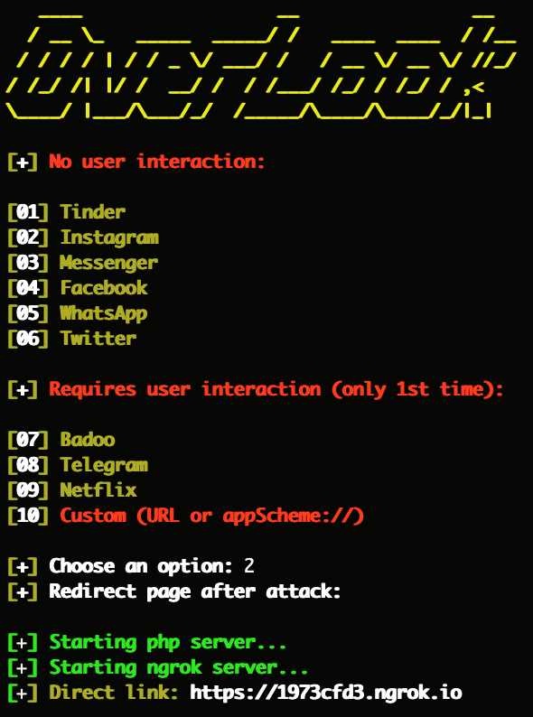

# OverLook v1.0

OverLook is a tool to know if an app is installed on the victim's android or iOS device by shraing a link with the victim.

## Instagram: https://instagram.com/programemerz



### Features:

#### Works on both Android and iPhone
#### Auto detect device
#### Port Forwarding by Ngrok
#### IP Tracker

## Legal disclaimer:

Usage of OverLook for attacking targets without prior mutual consent is illegal. It's the end user's responsibility to obey all applicable local, state and federal laws. Developers assume no liability and are not responsible for any misuse or damage caused by this program. 

### Usage:
```
git clone https://github.com/programemerz/overlook
cd overlook
bash overlook.sh
```
